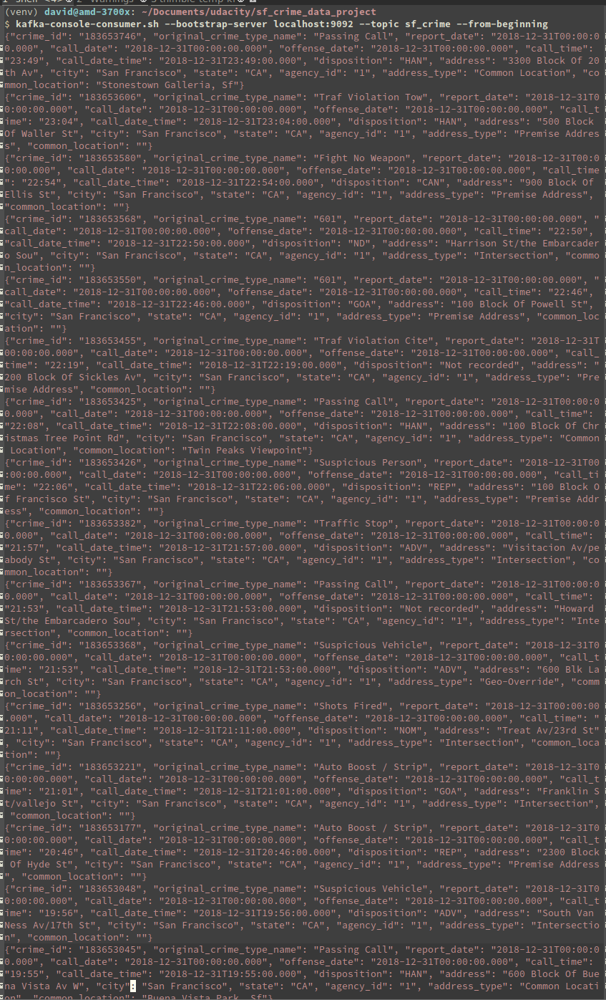
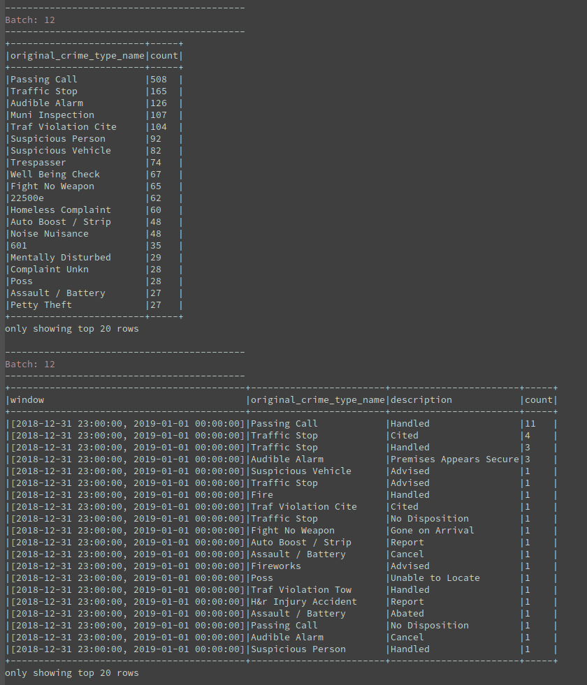

# Start Kafka Cluster

We use Clojure to start the kafka clusters. See clojure folder.

## Kafka cluster

You need to install [Clojure Cli](https://clojure.org/guides/getting_started)

``` bash
make kafka-cluster
```
The command will get into the clojure directory and launch the clojure-cli
and download all the deps and launch a kafka cluster with the "sf_crime" topic.

## Python env

``` bash
conda create -n venv
conda activate venv
conda install -c conda-forge --file requirement.txt

```

## Kafka server

``` bash
make kafka-server
```

## Kafka consumer

This is the default kafka console consumer

``` bash
make kafka-consumer # console
make kafka-consumer-py # python
```

## Data Stream

``` bash
make data-stream #
# Manually
# spark-submit --verbose --packages org.apache.spark:spark-sql-kafka-0-10_2.11:2.4.3 data_stream.py
```

# Screenshot

## Kafka Consumer



## Console Spark Reporting



## Spark UI


# Answers to questions:

1. I increased the memory and the number of cores of the executor to increase
througput, by increase a bit the latency. The rate of data arriving into our
spark streaming application. I tried to use `processedRowsPerSecond` (the rate
at which Spark is processing data) to control the number of records being
processed as well.

2.  I play with the `spark.default.parallelism` and the
`spark.streaming.kafka.maxRatePerPartition` to increase throughput. There is
balance between number of process and communication trade off though. I chose
to have the same number as logical cores as my machine and have a max rate of
per partition of 10 to balance between the kafka partition. This increased my
processing bit a factor of 2.
